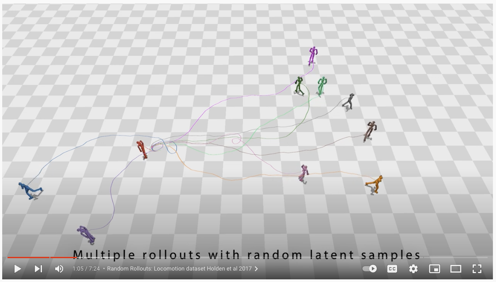

# PhysicsVAE

## Introduction

[](https://www.youtube.com/watch?v=6vZkzVvHUzg)

This repository provides executable codes for the paper *Physics-based Character Controllers Using Conditional VAEs*, which was published in SIGGRAPH 2022. Click [here](https://research.facebook.com/publications/physics-based-character-controllers-using-conditional-vaes/) to see the paper.

Please note that we are not able to guarantee that the codes will work if it is run with settings that we did not intend when we developed for the project. We would appreciate it if users could report the problems when they find it.

## Citation

```
@article{
    PhysicsVAE,
    author = {Won, Jungdam and Gopinath, Deepak and Hodgins, Jessica},
    title = {Physics-based Character Controllers Using Conditional VAEs},
    year = {2022},
    issue_date = {Aug 2022},
    volume = {41},
    number = {4},
    url = {https://doi.org/10.1145/3528223.3530067},
    journal = {ACM Trans. Graph.},
    articleno = {96},
}
```

## Getting Started

### Installation

Although we only confirmed that the codes work correctly in Ubuntu (20.04) environment, probably it will work in other environments without much troubles if it is installed in a fresh Python virtual environment, which we recommend users to use to prevent from mixing different pakage versions.

#### PhysicsVAE

```
git clone https://github.com/facebookresearch/PhysicsVAE
```

#### fairmotion

[fairmotion](https://github.com/facebookresearch/fairmotion) provides functionalities to process motion capture data and, to compute kinematics, to visualize simulated characters and environments. Follow the link for the installation.

#### others

We use [PyBullet](https://pybullet.org/wordpress/) for physics simulation and [rllib](https://docs.ray.io/en/latest/rllib.html) for reinforcement learning. 

```
pip install pybullet==3.1.7 ray[rllib]==1.11.0 pandas requests
```

#### Installation Test

To test installation, please see the script below and check whether the simulation environment is loaded properly.

```
python3 rllib_driver.py --mode load --spec data/spec/loco/loco_test.yaml --project_dir ../PhysicsVAE/
```

### Training

The process of training includes 3 steps: preparing expert demonstrations, pre-training the world model (simulation), and learning the entire model.

#### Prepraring expert demonstrations

In principle, expert demonstrations (s1, a1, s2, a2, ...) from any existing controllers can be used. In our implementation, we use deep RL imitation controllers *ScaDiver* to generate our demonstrations. To make this repo self-contained, *ScaDiver* codes and training scrips are included in this repo. Please see the original [repo](https://github.com/facebookresearch/ScaDiver) for more details.

Please run the script below to learn a *ScaDiver* imitation policy for the locomotion dataset. Here, we created the locomotion data by runnning the pre-trained PFNN [Holden et al. 2017] controller with random joystick inputs.

```
python3 rllib_driver.py --mode train --spec data/spec/loco/loco_imitation.yaml --project_dir ../PhysicsVAE/ --local_dir SAVE_DIR_FOR_CHECKPOINT --num_workers 40 --num_cpus 320 --num_gpus 0
```

Once learned, you can generate expert demonstrations (s1, a1, s2, a2, ...) by the following script. Our implementation to genearte this only utilize a single CPU, so please keep in mind that this process can take several hours. For example, if we want to create motions that is 100 minutes long in total (10 min x 10 iteration), in some slow workstations, you may really need to wait for 100 minutes because physics simulation is computationally expensive. 

```
python3 rllib_driver.py --mode gen_expert_demo --spec data/spec/loco/loco_imitation.yaml --project_dir ../PhysicsVAE/ --checkpoint SAVED_CHECKPOINT
```

Once finished, you will get a pickled file that includes the demonstrations of which data structure looks like below. For more details, please refer to "train_physics_vae.py".

```
DATASET (DICT):
{
    dim_action: 
        The dimension of action
    dim_state: 
        The dimension of state
    dim_state_body: 
        The dimension of proprioceptive state
    dim_state_task: 
        The dimension of task (goal) state
    exp_std: 
        std of Gaussian policy used for generating episodes. 
        This is the main source why each episode is different from each other
        even if they be run with the same referece motion
    iter_per_episode:
        How many episodes are generated for the same reference motion
    episodes: 
        A list of episodes [ep_1, ep_2, ..., ep_N]
}
EPISODE (DICT):
{
    time:
        A list of elapsed times [t_1, t_2, ..., t_T]
    state:
        A list of states [s_1, s_2, ..., s_T]
    state_body:
        A list of proprioceptive states [sb_1, sb_2, ..., sb_T]
    state_task:
        A list of task (goal) states [sg_1, sg_2, ..., sg_T]
    action:
        A list of actions [a_1, a_2, ..., a_T]
    reward:
        A list of rewards [r_1, r_2, ..., r_T]
}
```

#### Pre-training the world model (simulation) and learning the entire model

In our implmentation, we can run the remaining two precedures with a single scrip, where the world model will be pre-trained for *max_iter_world_model* iterations first then the entire model will be trained for the remaining *max_iter - max_iter_world_model* iterations while the world model keeps fixed.

```
# This will train both the world model (for 300 iterations) and the entire model (for 500 iterations)
python train_physics_vae.py --max_iter 800 --max_iter_world_model 300 --data_train PICKLED_EXPERT_DEMONSTRATIONS

# This will train the world model only
python train_physics_vae.py --max_iter 300 --max_iter_world_model 300 --data_train PICKLED_EXPERT_DEMONSTRATIONS

# This will train the entire model where the world model is fixed by the given weights (PRETRAINED_WORLD_MODEL)
python train_physics_vae.py --max_iter 500 --max_iter_world_model 0 --data_train PICKLED_EXPERT_DEMONSTRATIONS --world_model PRETRAINED_WORLD_MODEL
```

### Runtime

The simulation environment with the learned model can be loaded by the script below. After the system is loaded, press ***a*** to run/stop the simulation and ***r*** to reset the simulation. Use ***q*** to change the policy evaluation method, where *full* means that the entire model (task encoder + motor decoder) will be used to generate the action while *pass_through* will only infer the motor decoder by using the preprioceptive state and a random noise from the standard normal distribution. Please refer to "rllib_env_imitation.py" for more details.

```
python3 rllib_driver.py --mode load --spec data/spec/loco/loco_imitation.yaml --project_dir ../PhysicsVAE/ --checkpoint SAVED_CHECKPOINT
```

## Precomputed Data & Pretrained Model

To be updated.

## License

This repo is released under the [CC-BY-NC 4.0](https://github.com/facebookresearch/PhysicsVAE/blob/main/LICENSE).
